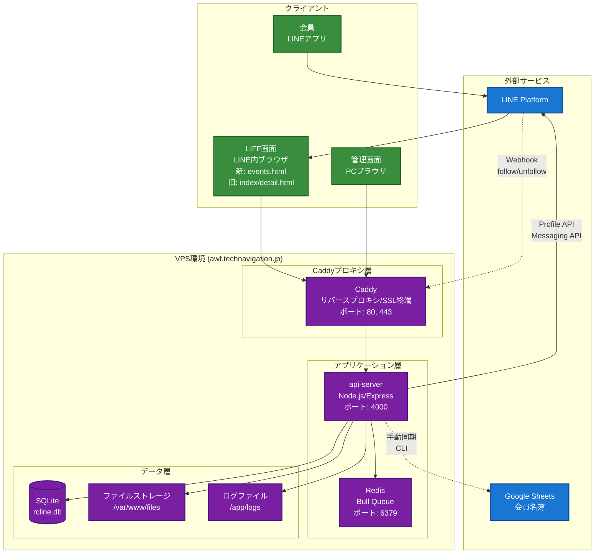
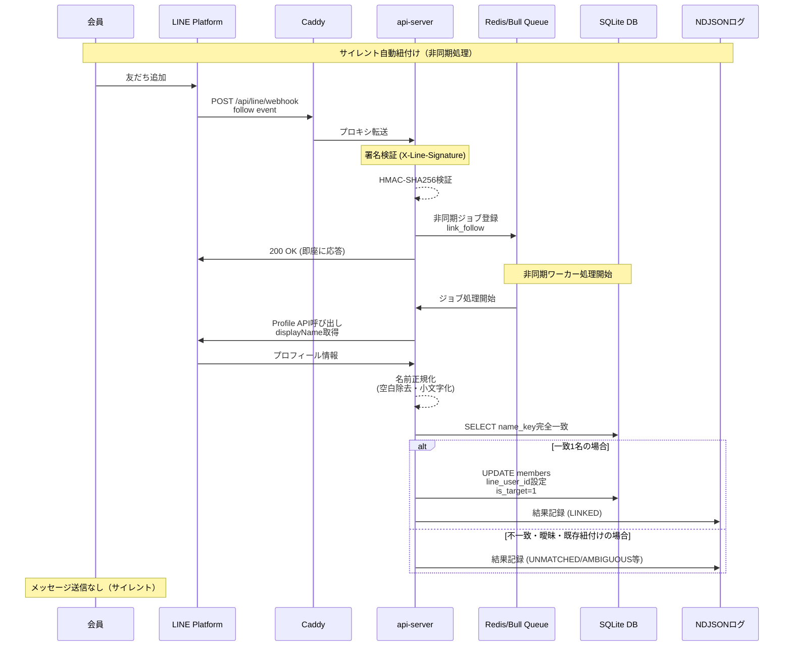
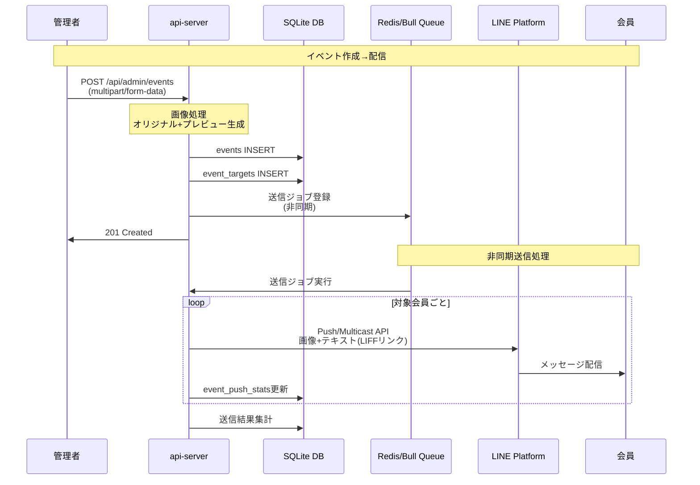
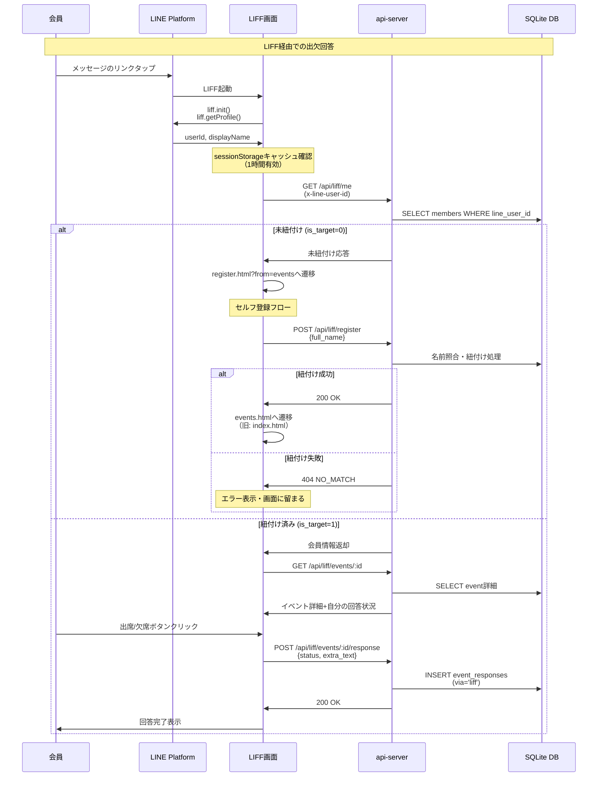
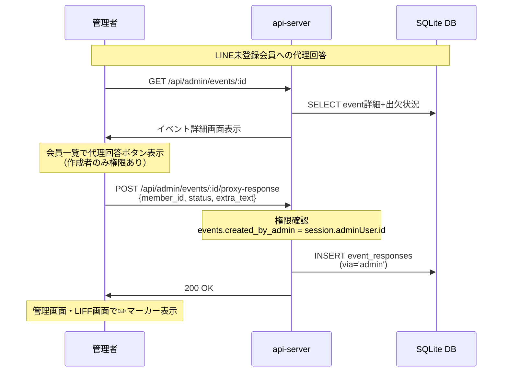
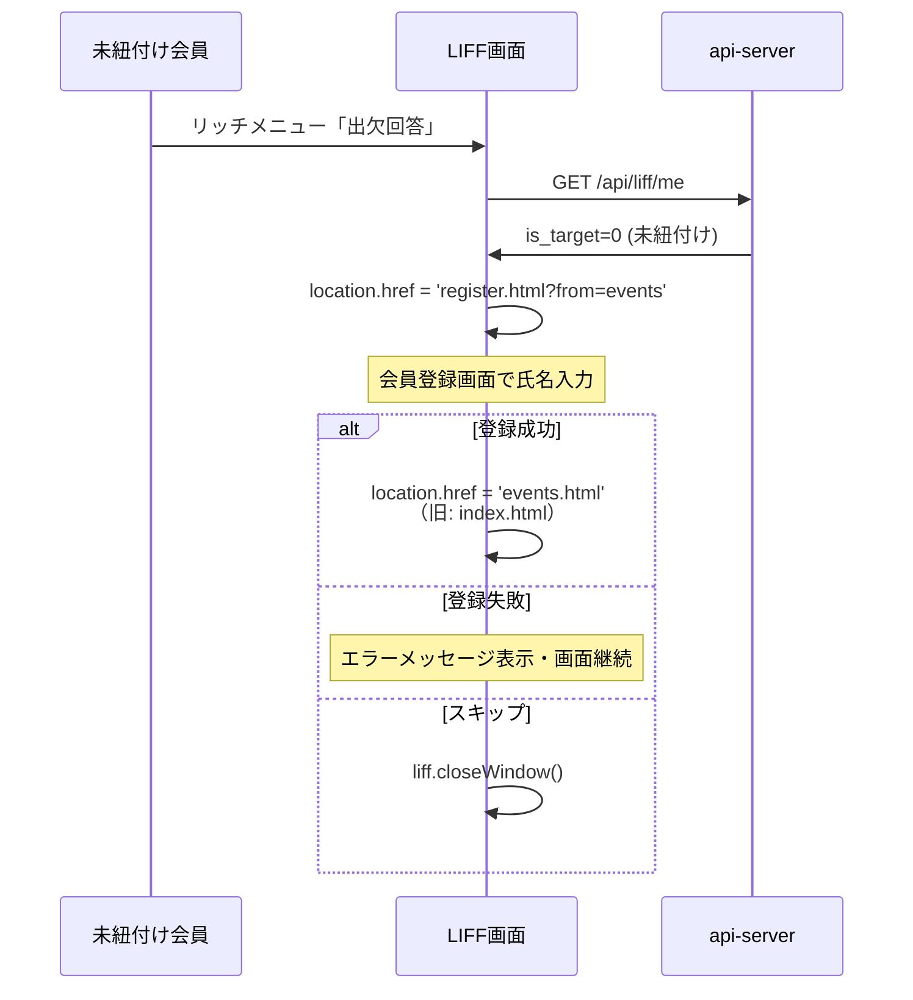
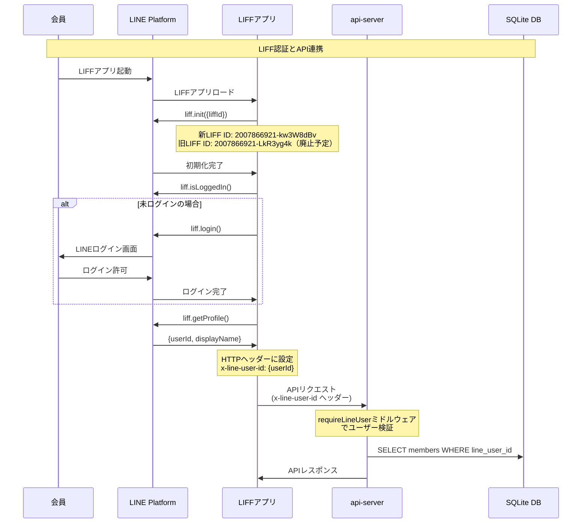
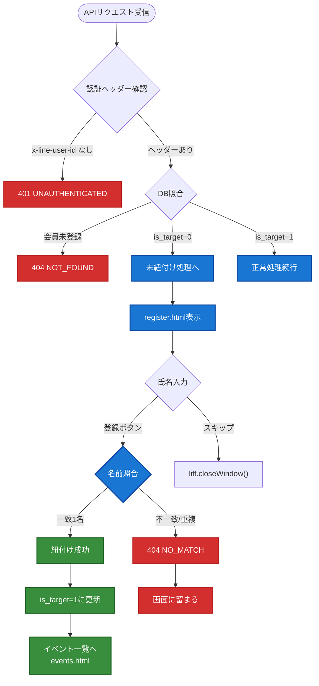
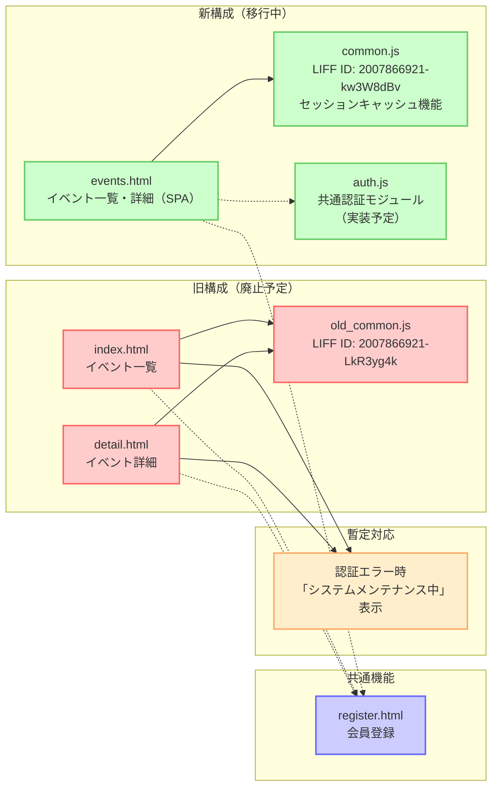
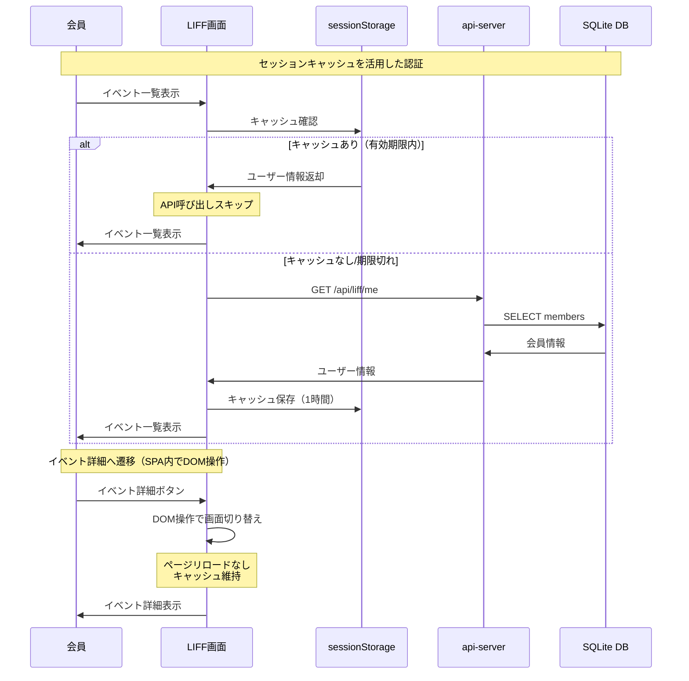

# 公式LINE出欠回答システム 外部連携図（Mermaidコード）

**更新日**: 2025-09-20（LIFF統合改善を反映）

## 1. システム全体概要図

## 2. 友だち追加時の自動紐付けフロー

## 3. 出欠依頼メッセージ配信フロー

## 4. 出欠回答フロー（LIFF）

## 5. 代理回答フロー（管理画面）

## 6. 未紐付けユーザーの自動誘導フロー

## 7. LINE認証・連携の詳細フロー

## 8. エラーハンドリングフロー

## 9. LIFF画面統合改善（SPA化）フロー

## 10. セッションキャッシュフロー

