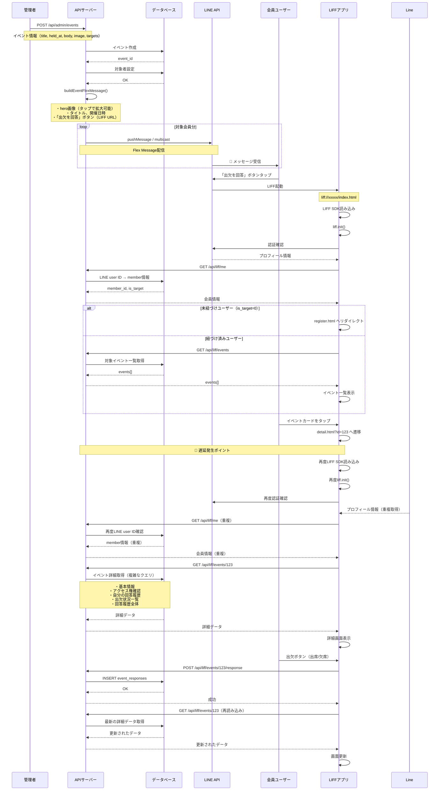

# 135_出欠依頼メッセージ配信とLIFF遷移フロー

**作成日**: 2025-01-05  
**更新日**: 2025-01-05  

## 概要

本文書は、RC公式LINEシステムの「出欠依頼メッセージ配信」から「LIFF画面での出欠回答」までの処理フローを詳細に図解します。特にLIFF画面間の遷移（index.html→detail.html）において発生する処理遅延の原因分析と改善提案を含みます。

---

## 全体処理フロー



---

## 処理遅延の原因分析

### 1. **LIFF SDK初期化の重複実行**
- `index.html` と `detail.html` で各々LIFF SDKを読み込み
- 画面遷移時に再度 `liff.init()` が実行される
- 認証状態の再確認が発生

### 2. **認証処理の重複**
- `/api/liff/me` が画面遷移のたびに呼び出される
- LINEユーザーID → 会員情報の変換処理が重複実行
- 認証ミドルウェア `requireLineUser` が毎回実行

### 3. **複雑なデータベースクエリ（`/api/liff/events/:id`）**
```sql
-- イベント詳細取得で実行される重いクエリ
SELECT e.id, e.title, e.held_at, e.body, 
       e.image_url, e.image_preview_url,
       e.extra_text_enabled, e.extra_text_label, e.extra_text_attend_only,
       e.created_by_admin
FROM events e WHERE e.id = ?;

-- アクセス権確認（UNION使用）
SELECT 1 as has_access FROM (
  SELECT et.member_id FROM event_targets et WHERE et.event_id = ? AND et.member_id = ?
  UNION
  SELECT au.member_id FROM admin_users au WHERE au.id = ? AND au.member_id = ?
) LIMIT 1;

-- 出欠状況一覧（JOINとWINDOW関数使用）
SELECT et.member_id, m.name, m.is_target,
       COALESCE(latest_response.status, 'pending') as status,
       COALESCE(latest_response.extra_text, '') as extra_text,
       latest_response.responded_at,
       COALESCE(latest_response.via, '') as via
FROM event_targets et
JOIN members m ON et.member_id = m.id
LEFT JOIN (
  SELECT er.member_id, er.status, er.extra_text, er.responded_at, er.via,
         ROW_NUMBER() OVER (PARTITION BY er.member_id ORDER BY er.responded_at DESC) as rn
  FROM event_responses er WHERE er.event_id = ?
) latest_response ON et.member_id = latest_response.member_id AND latest_response.rn = 1
WHERE et.event_id = ?
ORDER BY m.display_order ASC NULLS LAST, m.name ASC;

-- 回答履歴全体
SELECT er.responded_at, m.name, er.status, er.extra_text, er.via
FROM event_responses er
JOIN members m ON er.member_id = m.id
WHERE er.event_id = ?
ORDER BY er.responded_at DESC;
```

### 4. **ネットワーク往復の多さ**
- `index.html` → `detail.html` 遷移時に最低4回のAPI呼び出し
  1. `/api/liff/me`（認証確認）
  2. `/api/liff/events/:id`（詳細取得）
  3. 回答後の `/api/liff/events/:id/response`（回答送信）
  4. 再度 `/api/liff/events/:id`（画面更新）

---

## 改善提案

### A. **短期改善（実装コストlow）**

#### A1. 認証情報のセッション保持
```javascript
// common.js への追加
const SESSION_STORAGE = {
    USER_INFO: 'liff_user_info',
    EXPIRES: 'liff_session_expires'
};

async function getCachedCurrentUser() {
    const cached = sessionStorage.getItem(SESSION_STORAGE.USER_INFO);
    const expires = sessionStorage.getItem(SESSION_STORAGE.EXPIRES);
    
    if (cached && expires && Date.now() < parseInt(expires)) {
        return JSON.parse(cached);
    }
    
    // キャッシュなしまたは期限切れの場合はAPI呼び出し
    const user = await getCurrentUser();
    if (user) {
        sessionStorage.setItem(SESSION_STORAGE.USER_INFO, JSON.stringify(user));
        sessionStorage.setItem(SESSION_STORAGE.EXPIRES, (Date.now() + 300000).toString()); // 5分
    }
    return user;
}
```

#### A2. データベースクエリの最適化
```sql
-- インデックス追加提案
CREATE INDEX IF NOT EXISTS idx_event_targets_lookup ON event_targets(event_id, member_id);
CREATE INDEX IF NOT EXISTS idx_event_responses_latest ON event_responses(event_id, member_id, responded_at);
CREATE INDEX IF NOT EXISTS idx_members_display ON members(display_order, name);
```

#### A3. API応答の軽量化
```javascript
// 詳細画面で不要な情報を遅延読み込み
router.get('/events/:id', requireLineUser, async (req, res) => {
    const include = req.query.include?.split(',') || [];
    
    const response = {
        id: event.id,
        title: event.title,
        held_at: event.held_at,
        can_respond: true,
        my_response: myResponse
    };
    
    // オプション情報の遅延読み込み
    if (include.includes('attendance')) {
        response.attendance_status = await getAttendanceStatus(eventId);
    }
    if (include.includes('history')) {
        response.response_history = await getResponseHistory(eventId);
    }
    
    res.json(response);
});
```

### B. **中期改善（実装コストmiddle）**

#### B1. LIFF SPAアーキテクチャ
```javascript
// 単一HTML + JavaScript Router
class LIFFApp {
    constructor() {
        this.currentUser = null;
        this.liffInitialized = false;
    }
    
    async init() {
        if (!this.liffInitialized) {
            await liff.init({ liffId: CONFIG.LIFF_ID });
            this.currentUser = await this.getCurrentUser();
            this.liffInitialized = true;
        }
    }
    
    async navigateToDetail(eventId) {
        // ページ遷移せず、DOM書き換えのみ
        history.pushState({}, '', `#detail/${eventId}`);
        await this.renderDetailView(eventId);
    }
}
```

#### B2. 必要最小限データの先読み
```javascript
// イベント一覧取得時に基本詳細情報も含める
router.get('/events', requireLineUser, async (req, res) => {
    const events = await db.all(`
        SELECT e.id, e.title, e.held_at, e.body,
               e.image_preview_url, e.extra_text_enabled,
               my_response.status as my_status
        FROM events e
        LEFT JOIN (最新回答) my_response ON ...
        WHERE 対象条件
    `);
    
    res.json(events);
});
```

### C. **長期改善（実装コストhigh）**

#### C1. 本格的SPA化
- React/Vue.js等のフレームワーク導入
- 状態管理ライブラリでデータ共有
- Service Worker による積極的キャッシュ

#### C2. GraphQL導入
```graphql
query GetEventDetail($id: ID!) {
    event(id: $id) {
        id
        title
        heldAt
        myResponse {
            status
            extraText
        }
        attendanceStatus @include(if: $includeAttendance) {
            member { name }
            status
        }
    }
}
```

---

## 推奨改善案

### 第1段階：A1（認証キャッシュ）+ A2（インデックス追加）
- **効果**: 画面遷移時間を30-50%短縮見込み
- **実装時間**: 1-2時間
- **リスク**: 低

### 第2段階：A3（API軽量化）
- **効果**: 初期表示を20-30%高速化
- **実装時間**: 2-3時間
- **リスク**: 低

### 第3段階：B1（SPA化）
- **効果**: 画面遷移を80%以上高速化
- **実装時間**: 1-2日
- **リスク**: 中（テスト工数増加）

---

## 関連資料

- [131_外部連携設計.md](131_外部連携設計.md) - 全体アーキテクチャ
- [045_技術ノート_LIFF開発とデバッグ手法_20250829.md](../200_技術ノート/045_技術ノート_LIFF開発とデバッグ手法_20250829.md) - LIFF実装詳細
- [CLAUDE.md](../000_重要/CLAUDE.md) - 開発者向け手引書

---

**更新履歴**:
- 2025-01-05: 初版作成、遅延原因分析と改善提案を追加