# VPS セキュリティ運用メモ（統合版）
## 1. 現状（2025-09時点）
- VPSはインターネット公開されており、SSHスキャンが大量に来ている。
- SSH設定:
  - パスワードログイン禁止（秘密鍵必須）
  - rootパスワードログイン禁止
  - UseDNS no / GSSAPIAuthentication no
  - SSHポート: **10022 のみ**開放中
- 外部ファイアウォール（Xserver VPSパネル）: **22閉じ、10022開け**
- サーバ内 `/etc/ssh/sshd_config`: **Port 10022**
- fail2ban 監視対象: **10022**

### セキュリティ構成図

```mermaid
graph LR
    subgraph Internet["インターネット"]
        User["正規ユーザ<br/>（秘密鍵所持）"]
        WebUser["Webユーザ"]
        Attacker["攻撃者<br/>（SSHスキャン）"]
    end
    
    subgraph ExtFW["外部FW<br/>（Xserver VPSパネル）"]
        ExtRule1["✅ 80/tcp 許可"]
        ExtRule2["✅ 443/tcp 許可"]
        ExtRule3["✅ 10022/tcp 許可"]
        ExtRule4["❌ 22/tcp 拒否"]
    end
    
    subgraph VPS["VPSサーバ"]
        subgraph UFW["内部FW（ufw）"]
            UFWRule1["✅ 80/tcp 許可"]
            UFWRule2["✅ 443/tcp 許可"]
            UFWRule3["✅ 10022/tcp 許可"]
            UFWRule4["❌ 20,21/tcp 拒否"]
            UFWRule5["❌ その他 拒否<br/>（デフォルト）"]
        end
        
        subgraph Services["サービス"]
            Web["Webサーバ<br/>（80/443）"]
            SSH["SSHサーバ<br/>（10022）<br/>秘密鍵認証のみ"]
        end
        
        subgraph Protection["防御機構"]
            F2B["fail2ban<br/>10022監視<br/>1回失敗→10時間BAN"]
        end
    end
    
    WebUser -->|"HTTP/HTTPS"| ExtRule1
    WebUser -->|"HTTP/HTTPS"| ExtRule2
    User -->|"SSH(10022)"| ExtRule3
    Attacker -->|"SSH(22)❌"| ExtRule4
    Attacker -->|"SSH(10022)"| ExtRule3
    
    ExtRule1 --> UFWRule1
    ExtRule2 --> UFWRule2
    ExtRule3 --> UFWRule3
    
    UFWRule1 --> Web
    UFWRule2 --> Web
    UFWRule3 --> SSH
    
    SSH -.->|"監視"| F2B
    F2B -.->|"BAN設定"| UFW
    
    style Attacker fill:#552222
    style ExtRule4 fill:#552222
    style UFWRule4 fill:#552222
    style UFWRule5 fill:#552222
    style User fill:#224422
    style WebUser fill:#224422
    style F2B fill:#554422
```



---

## 2. 今回の対応内容
1. **fail2ban導入と強化**
   - 失敗1回 → 即BAN
   - BAN時間: 10時間 (36000秒)
   - findtime: 10分 (600秒)
   - 自分は秘密鍵ログインなので影響なし

2. **SSHポート変更**
   - 外部FWで「22閉じ、10022開け」
   - sshd_configで「Port 10022」
   - fail2banも10022のみ監視

3. **UFW（内部ファイアウォール）設定**
   - ufw enable で有効化
   - 許可ポート:
     - 80/tcp (HTTP)
     - 443/tcp (HTTPS)
     - 10022/tcp (SSH)
   - 拒否ポート:
     - 20/tcp, 21/tcp (FTP)
   - デフォルトポリシー: incoming=deny, outgoing=allow

4. **多層防御構成まとめ**
   - **ファイアウォール（2層）**:
     - 外部FW（Xserver VPSパネル）: 22閉じ、10022開け
     - 内部FW（ufw）: 10022/tcp許可、80/443許可、FTP拒否
   - **SSH防御（4要素）**:
     - 外部FW: ポート10022のみ開放
     - sshd_config: Port 10022設定
     - ufw: 10022/tcp許可
     - fail2ban: port=10022監視、1回失敗で即BAN

---

## 3. 設定ファイル例
### /etc/fail2ban/jail.local
```ini
[sshd]
enabled  = true
port     = 10022
backend  = systemd

maxretry = 1
findtime = 600
bantime  = 36000
ignoreip = 127.0.0.1/8
```

---

## 4. 確認コマンド
- fail2ban 状態確認  
```bash
fail2ban-client status sshd
```

- sshd の待受ポート確認  
```bash
ss -tlnp | grep sshd
```

- ufw 状態確認  
```bash
ufw status verbose
```

- 外部FW: Xserver VPSパネルで確認

---

## 5. BAN復旧手順
### 症状
- SSH接続できない (`Connection refused` や `reset by peer`)

### 復旧方法
- Xserver VPSの「コンソール」からログインし、以下を実行

#### A. BAN解除
```bash
fail2ban-client status sshd
fail2ban-client set sshd unbanip <自分のIP>
```

#### B. 応急処置（最悪の場合）
```bash
systemctl stop fail2ban
# 修正後
systemctl start fail2ban
```

---

## 6. 今後の注意点
- SSH接続は必ず「10022」で行う
- 変更時は以下の多層防御を忘れないこと:
  - **FW2層**: 外部FW（Xserverパネル）/ ufw（内部）
  - **SSH4要素**: 外部FW / sshd_config / ufw / fail2ban
- Xserverパネルの「備考欄」にメモを残す:
  > SSHは10022番に変更済み。22は閉鎖中。fail2banも10022監視。
  > ufwで80,443,10022許可、FTP拒否設定済み。
  > →対応済み。
